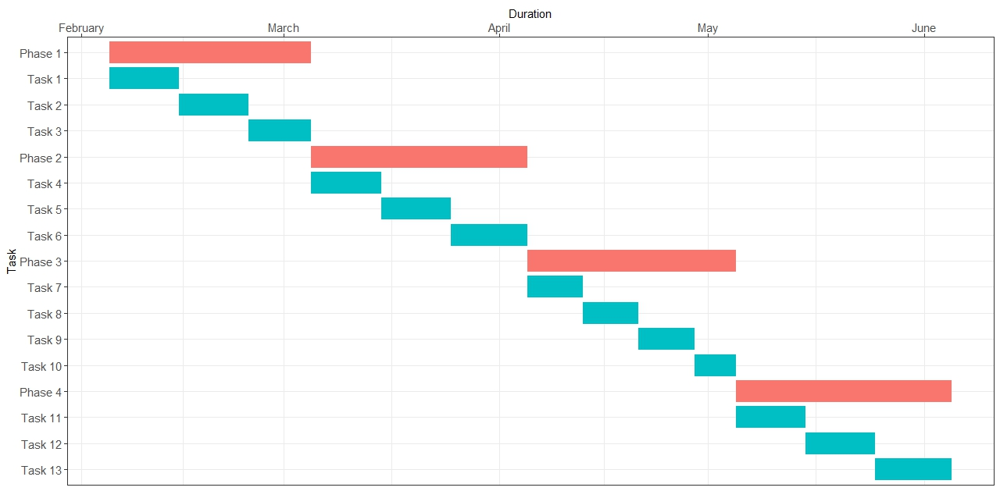

# Gantt Chart with R

This repository contains R code to create a Gantt chart using the `ggplot2` package. The chart visualizes tasks and phases over time, providing a clear and concise project timeline.


*Example of Gantt Chart in action.*

## Prerequisites

Make sure you have R installed on your system. You also need to install the following R packages:

- `tidyverse`
- `ggplot2`


You can install these packages by running:

```bash
install.packages("tidyverse")
install.packages("ggplot2")

```

## Usage

1. Clone this repository.
2. Open the R script containing the above code.
3. Run the script in your R environment.

This will generate a Gantt chart visualizing the specified tasks and phases over time.

## Customization

You can customize the tasks, start dates, end dates, and phases by modifying the `Gantt` data frame in the code. Adjust the aesthetics and themes in the `ggplot` function as needed to suit your preferences.

## License
This project is licensed under the MIT License.
